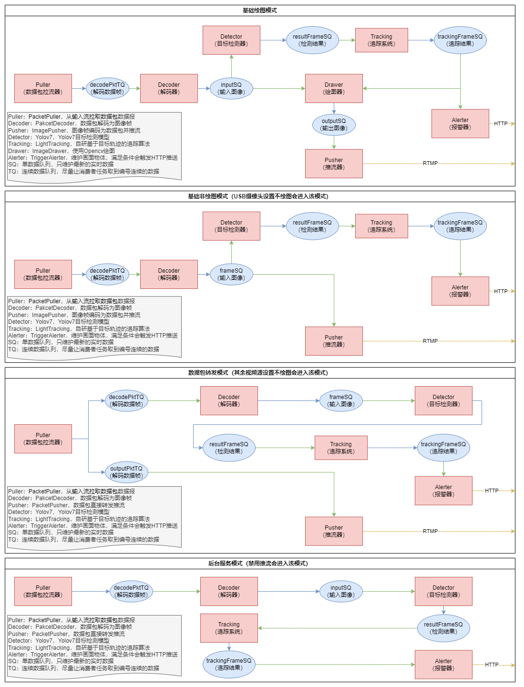

# 介绍

小板凳辅助，帮助统计用餐人数并推送（C++）。
采用Yolov7算法，通过读取输入视频源（RTSP、USB摄像头等），经过自创轻量级目标跟踪算法去重检测，将告警信息实时通过HTTP接口推送，同时将视频源进行转发并利用RTMP协议推送。其中告警条件可拓展，目前支持的条件为物体：

* 出现（某个物体在画面中第一次出现）
* 离开（某个物体从画面中离开）
* 经过（物体从画面中的某个方向[上/下/左/右]经过）
* 滞留（物体留在画面中超过多少秒）
* 数量（物体的数量的逻辑运算[等于/不等于/大于/小于...]）
* ...

# 架构



# 编译

环境：

* 硬件：RK3588
* OS：Ubuntu
* 语言：C++17
* 工具：CMake、vcpkg等

## 安装环境

```bash
sudo apt-get install g++ ninja-build
```

还需要安装版本大于等于3.21的cmake，可以从[https://github.com/Kitware/CMake](https://github.com/Kitware/CMake)源码安装

```bash
git clone https://github.com/Kitware/CMake.git
cd CMake
./bootstrap && make -j8 && sudo make install
```

## 安装vcpkg

采用vcpkg作为依赖管理工具，不能用vcpkg安装的依赖都放在3rd目录下了。

安装vcpkg：

```bash
echo "export VCPKG_FORCE_SYSTEM_BINARIES=arm" >> ~/.bashrc
source ~/.bashrc
git clone https://github.com/microsoft/vcpkg.git
cd vcpkg
./bootstrap-vcpkg.sh
echo "export VCPKG_ROOT=$(pwd)" >> ~/.bashrc
echo "export PATH=\$VCPKG_ROOT:\$PATH" >> ~/.bashrc
source ~/.bashrc
```

## 安装依赖

安装程序所用依赖，依赖项在 `vcpkg.json`中：

*出现某文件下不下来的情况时，可以手动下载放到它指定的地方*

```bash
git clone https://gitee.com/purple-sky/edge-warning-cpp.git
cd edge-warning-cpp
vcpkg install
```

## RKNN库

请安装对应版本的 `rknn_api.so`到 `/lib`中，`rknn_api.h`到 `/usr/include`中：[https://github.com/rockchip-linux/rknpu2](https://github.com/rockchip-linux/rknpu2)

## 编译

```bash
cmake -Bbuild --preset=release
# cmake -Bbuild --preset=debug
# cmake -Bbuild --preset=min-release
cmake --build build
```

程序会生成在 `build/bin`目录下。

## VSCode开发

1. 安装CMake Tools插件
2. 确保在登录VSCode的用户对应的.bashrc中已经设置了VCPKG_ROOT环境变量，如果没有可以使用该命令设置: `echo "export VCPKG_ROOT={vcpkg根目录}" >> ~/.bashrc`
3. 重新登录VSCode应用环境变量
4. 打开项目根目录，在下方工具栏选择相应的的预设，然后生成即可

# 使用情景

不同情景可以参考不同的配置，下面提供几种情景。

## 无需观看画面，后台运行


禁用推流和绘制画面预测框，适当调整检测跳帧以降低开销。

## 需要观看画面，但以AI功能为主


不禁用推流，同时可以对推流设置进行调整，如果不需要高清画质可以降低码率（默认600KB/s），如果输入摄像头分辨率特别大（2K+）也可以调一个比较低的分辨率，推流线程建议设置为1。

同时关闭图像绘制，适当调整检测跳帧降低开销。

程序会进入数据包转发模式（USB摄像头会进入基础非绘图模式）

## 画面演示模式


对于分辨率比较高的摄像头（2K+）可以适当选择一个较低的分辨率，可提高推流码率以提高画质，同时适当增加推流线程以提高流畅度（比如4），如需更低延迟也可以打开低延迟模式，但会增加开销从而可能降低帧率。

打开画面绘制，同时可以取消跳帧，以增加框的流畅度。